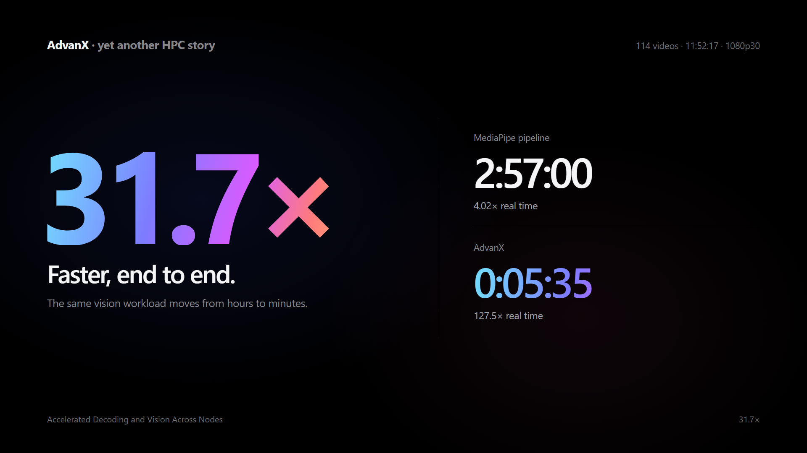
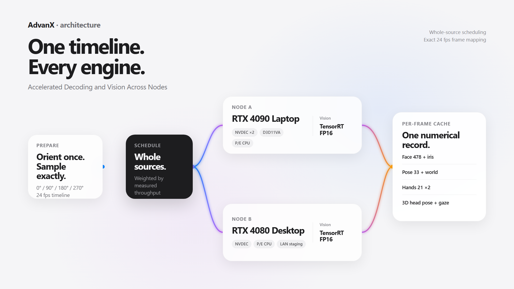

# AdvanX

**Accelerated Decoding and Vision Across Nodes** — pronounced “advance.” The X is a visual mark for the cross-device execution fabric.

AdvanX turns long-form source videos into an exact, per-frame numerical cache of face, iris, body, hands, 3D head pose, and gaze. It keeps every stage on one timebase while distributing whole videos across NVIDIA decode, Intel D3D11VA, CPU decode, TensorRT inference, and multiple machines.



## What it solves

- Detects source orientation once from the first frame at 0° / 90° / 180° / 270° and reuses that decision for the complete video.
- Maps any source rate, including 100 fps, onto an exact 24 fps timeline without re-encoding the training material.
- Runs full-frame face, iris, pose, world pose, and hand inference through fixed-geometry TensorRT FP16 engines.
- Schedules complete source videos by measured lane throughput and remote transfer cost.
- Mixes NVDEC, Windows Intel D3D11VA under WSL, and FFmpeg software-decode lanes.
- Writes restartable, memory-mapped NumPy columns plus smoothed traces and motion envelopes.
- Validates source signatures, full decode coverage, frame indices, timestamps, and every output array.



## Pipeline

```text
inventory → deduplicate → orient first frame → build catalog
          → exact target timeline → heterogeneous decode lanes
          → TensorRT Holistic graph → temporal smoothing → validated cache
```

The cache contains 48 aligned arrays per source. The main tensors are face landmarks `(T, 478, 3)`, pose landmarks `(T, 33, 5)`, world pose `(T, 33, 3)`, two hands `(T, 21, 3)`, head rotation, iris measurements, confidence values, and smoothed/envelope traces.

## Requirements

- Linux or WSL2, Python 3.10+, FFmpeg and FFprobe
- NVIDIA CUDA, TensorRT 11, PyTorch, Triton, and PyNvVideoCodec
- OpenCV, ONNX tooling, and model conversion dependencies used by `tools/`
- Optional: Intel iGPU and a Windows FFmpeg build with D3D11VA support
- SSH and SCP for a second node

Create the locked development environment with uv:

```bash
uv sync --locked
uv run pytest
```

The repository includes `uv.toml`, `.python-version`, and `uv.lock`. The default sync installs the lightweight project plus its test group. Use `uv sync --locked --no-dev` for the package without developer tooling.

GPU runtime packages are intentionally not pinned in `pyproject.toml`: CUDA, TensorRT, PyTorch, and PyNvVideoCodec must match the installed driver and platform. The validated environment is documented in [docs/runtime.md](docs/runtime.md).

## Models

No weights, MediaPipe task bundles, ONNX graphs, or TensorRT engines are included or downloaded. Supply the model assets you are licensed to use, then pass their paths explicitly or place them under `models/mediapipe/`. See [docs/models.md](docs/models.md).

TensorRT engines are hardware and TensorRT-version specific. Build them on the machine that will execute them.

## Quick start

Create an inventory from one or more recursively scanned folders:

```bash
python tools/inventory_video_folders.py \
  --root /data/videos \
  --folder set-a \
  --folder set-b \
  --output runs/inventory.json
```

Estimate orientation using fused engines for both portrait and landscape geometry:

```bash
python tools/audit_video_orientation.py runs/inventory.json \
  --output runs/orientation.json \
  --thumbnail-dir runs/orientation-thumbnails \
  --fused-engine models/mediapipe/fused/portrait.engine \
  --fused-engine models/mediapipe/fused/landscape.engine \
  --face-geometry-metadata models/mediapipe/face_geometry_procrustes.npz
```

Build the deduplicated catalog:

```bash
python tools/build_holistic_catalog_from_inventory.py \
  runs/inventory.json runs/orientation.json \
  --training-target-fps 24 \
  --output runs/catalog.json
```

Run one node with exact temporal sampling:

```bash
python tools/run_holistic_sources_trt.py runs/catalog.json \
  --output-dir outputs/holistic24 \
  --baseline-json calibration.json \
  --fused-only --native-nv12 --target-fps 24 \
  --fused-engine models/mediapipe/fused/portrait.engine \
  --fused-engine models/mediapipe/fused/landscape.engine \
  --face-geometry-metadata models/mediapipe/face_geometry_procrustes.npz
```

Preview a distributed capacity plan before execution:

```bash
python tools/dispatch_holistic.py runs/catalog.json \
  --output-dir outputs/holistic24 \
  --target-fps 24 --plan-only --plan-all \
  --workers-per-node 2 \
  --software-workers-per-node 2 \
  --local-igpu-workers 1 \
  --local-fps 1435 --remote-fps 1100 \
  --local-software-fps 118 --remote-software-fps 78 \
  --local-igpu-fps 120 --transfer-mib-s 38.9
```

Remove `--plan-only --plan-all`, provide the engines, baseline, remote host/runtime arguments, and rerun to execute the plan. AdvanX stages remote inputs onto the remote filesystem, returns only numerical outputs, and deletes the successful remote job unless `--keep-remote` is set.

Validate the finished cache:

```bash
python tools/validate_holistic_output.py \
  runs/catalog.json outputs/holistic24 \
  --target-fps 24 --report outputs/holistic24/validation.json
```

## Performance figure

The included performance slide uses a fixed 114-video, 11:52:17 workload normalized to 1080p30. The prior MediaPipe pipeline is 2:57:00 at 4.02× real time; the measured-component capacity model for AdvanX is 0:05:35 at 127.5× real time, a 31.7× end-to-end speedup. Method and limits are recorded in [docs/benchmark.md](docs/benchmark.md).

## Slides

The two 1920×1080 slides are authored in plain HTML/CSS at [slides/advanx-keynote.html](slides/advanx-keynote.html). Open the file in a browser and use the arrow keys. Add `?slide=1&export=1` or `?slide=2&export=1` for deterministic capture. A vertical 1920×2160 social version is available as [HTML](slides/advanx-social.html) and [PNG](assets/advanx-social-vertical.png).

## License

Code is licensed under Apache-2.0. Model assets and third-party runtimes are not redistributed; their own licenses apply. See [THIRD_PARTY.md](THIRD_PARTY.md).
